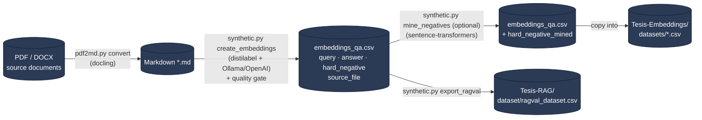

# Embedding Training Data Generator 🤖


    

## 📖 Overview

CLI tool that builds training data for **fine-tuning Spanish embedding models** used in RAG
and agentic tool-calling retrieval. It takes source documents (PDF / Word), converts them to
Markdown, and generates `(query, answer, hard_negative)` triplets grounded in the specific
facts of each passage — so a query actually discriminates its passage from similar ones,
which is what a contrastive/triplet embedding objective needs.

The output CSV feeds the sibling repo `Tesis-Embeddings` (the trainer). This repo does **not**
do retrieval evaluation — that lives in `Tesis-RAG` / `Tesis-Agent`.

## 🗺️ Pipeline flow

Each step is a CLI command reading/writing plain files on disk — no shared state.



> `create_embeddings` runs against any OpenAI-compatible endpoint: set `base_url` in its config
> to an Ollama server (the default, fully local) or leave it empty and export `OPENAI_API_KEY` to
> use OpenAI. `mine_negatives` downloads a `sentence-transformers` baseline model on first run.
> `pdf2md convert` is fully local (docling).

## 📦 Requirements

- Python 3.12 or higher
- Required libraries (see `requirements.txt`):
  - `jsonargparse`, `tqdm`, `pandas`
  - `docling` — PDF/DOCX → Markdown conversion
  - `distilabel[openai]` — grounded triplet generation (`create_embeddings`)
  - `sentence-transformers`, `datasets` — corpus hard-negative mining (`mine_negatives`)
- `OPENAI_API_KEY` exported in the environment for `create_embeddings`

## 🛠️ Installation

```bash
git clone https://iieg-app.jalisco.gob.mx/iieg-ia/llm-synthetic-data.git
cd llm-synthetic-data
pip install -r requirements.txt
```

## 🚀 Usage

> 💡 Every command reads its parameters from a YAML in `configs/`. Edit the config rather
> than passing flags.

### 1. Convert documents to Markdown

Converts every PDF and Word (`.docx`) file under the input directory to Markdown (via
`docling`), which is cleaner input for the LLM than raw PDF/DOCX.

```bash
python pdf2md.py convert --config configs/pdf2md.yaml
```

### 2. Generate embedding training data

Generates `(query, answer, hard_negative)` triplets — one query per paragraph, explicitly
grounded in that paragraph's facts/entities, plus a hard negative authored alongside it.
Structured output is enforced by `distilabel`'s `GenerateSentencePair` (no manual JSON
parsing). Writes `embeddings_qa.csv`.

Generated pairs go through an automated **quality gate** before being written (the criteria of
protocol section 10.3): unsubstituted `{placeholders}`, meta-instructions to the generator,
queries with no lexical anchoring to their passage, queries anchored only in generic vocabulary
with no figure or proper noun, and exact duplicates. Rejects land in `rejected_qa.csv` and the
rejection rate is logged. The gate exists because the first evaluation set had to be discarded:
all 17 models scored at chance level, and re-running the gate over that dataset rejects 100 % of it.

```bash
# Local generation against Ollama (default config)
python synthetic.py create_embeddings --config configs/create_embeddings.yaml

# ... or against OpenAI: clear base_url in the config first
export OPENAI_API_KEY=sk-...
python synthetic.py create_embeddings --config configs/create_embeddings.yaml
```

> ⚠️ Reasoning models served by Ollama (e.g. `qwen3.6`) return an **empty** answer unless thinking
> is disabled — the content goes to the `reasoning` field. Keep `disable_thinking: true` for them.

### 3. (Optional) Mine a real corpus hard negative

Adds a `hard_negative_mined` column — a *real* confusable passage from the corpus, found by
embedding similarity (usually a stronger negative than one the LLM imagines in isolation).
`Tesis-Embeddings`' trainer prefers this column when present.

```bash
python synthetic.py mine_negatives --config configs/mine_negatives.yaml
```

Copy the resulting CSV into `Tesis-Embeddings/datasets/` and train there.

### 4. Export the RAG evaluation set

Derives `Tesis-RAG`'s schema (`id, pregunta, chunk_id, chunk_content, documento`) from the same
generated CSV, so one generation feeds both the trainer and the retrieval evaluator. `chunk_id` is
the same SHA-256 prefix `Tesis-RAG` computes, and `documento` carries the source file — which is
what lets `Tesis-Embeddings` split by document (`--group-col source_file`) instead of by row.

```bash
python synthetic.py export_ragval --config configs/export_ragval.yaml
```

### On the DGX

`slurm/` holds one script per step. The whole pipeline (generation → training → both benchmarks)
is submitted as a single dependency chain from `Tesis-Embeddings/slurm/submit_all.sh`. Generation
needs a conda env with `distilabel` (`datagen`) and **no GPU allocation**: it talks over HTTP to the
`ollama serve` daemon already running on the node.

## 🤝 Contributing

Contributions are welcome! Please feel free to open an issue for any suggestions or improvements.

## 📜 License

This project is licensed under the MIT License - see the [LICENSE](./LICENSE) file for details.

## 🙏 Acknowledgments

- **[docling](https://github.com/DS4SD/docling)**: parses PDF, DOCX, XLSX, HTML and more, exporting to Markdown/HTML/JSON.
- **[distilabel](https://github.com/argilla-io/distilabel)**: synthetic data generation framework; its `GenerateSentencePair` task produces the grounded triplets with enforced structured output.
- **[sentence-transformers](https://www.sbert.net/)**: embedding models and `mine_hard_negatives` for corpus-grounded negative mining.
